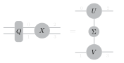

# Tensor Disentangler

This repository provides functionality for reducing entanglement in a tensor across specified dimensions by applying a unitary transformation to another set of dimensions. Such disentangling is important in many tensor network algorithms.

## Main Function

### `disentangle(X, dis_dims, svd_dims, **kwargs)`

- `X`: A tensor to be disentangled.
- `dis_dims`: List of dimensions of `X` on which the unitary disentangling matrix acts.
- `svd_dims`: List of dimensions of `X` across which the entanglement is minimized.

The user can specify additional keyword arguments, such as:
- Optimization algorithm
- Maximum wall time for disentangling
- Initial disentangler guess
- Other advanced options
